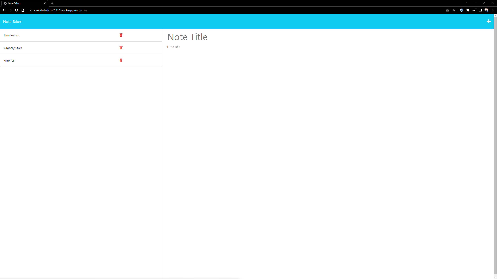
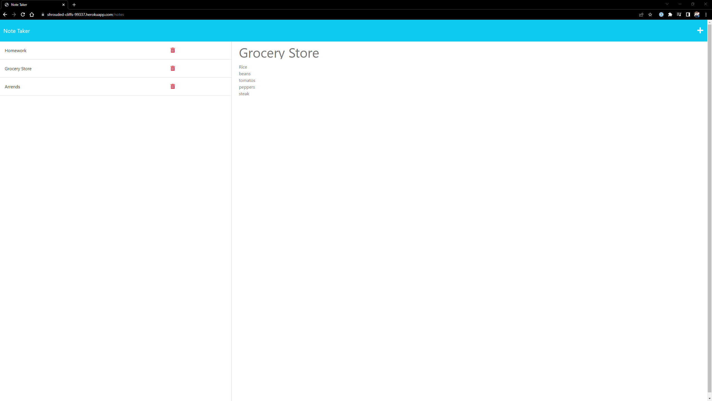
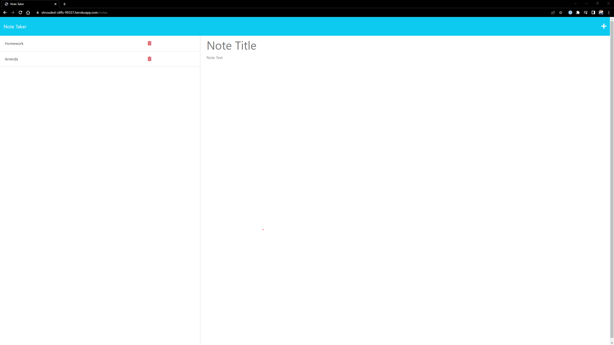

# Notepad

## Description

My motivation for this project was to make a simple program capable of recording notes and updating a database on the backend dynamically. Users will be able to add and delete notes on the front end, but this will affect the databse in the back end. 

## Installation

The webpage is available at https://github.com/zachcygan/notepad. Be sure to install any dependencies by typing in "npm i" in the console. This will install express, util, and uuidv4. 

The deployed application can be viewed at: https://shrouded-cliffs-99337.herokuapp.com/;

## Dependencies Used
    - express
    - util
    - uuidv4

## Instructions

To begin installing the program, to be sure to type "npm i" inside the terminal to install any dependencies. Notes can be added by clicking the plus button on the top right of the page. When clicked, a blank note will appear for the user to type in the note title and body. 

## Screenshots

